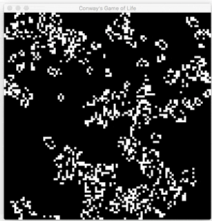

# Conway's Game of Life

`conways-gol` is a *Conway's Game of Life* implementation using Go and OpenGL with [go-gl](https://github.com/go-gl), and was developed as part of a tutorial I wrote on *OpenGL with Go*. 

To follow the tutorial and learn OpenGL with Go by implementing *Conway's Game of Life* for yourself, check out:

- [Part 1: Hello, OpenGL](https://kylewbanks.com/blog/tutorial-opengl-with-golang-part-1-hello-opengl): Install and Setup OpenGL and [GLFW](http://www.glfw.org/), Draw a Triangle to the Window
- [Part 2: Drawing the Game Board](https://kylewbanks.com/blog/tutorial-opengl-with-golang-part-2-drawing-the-game-board): Make a Square out of Triangles, Draw a Grid of Squares covering the Window
- [Part 3: Implementing the Game](https://kylewbanks.com/blog/tutorial-opengl-with-golang-part-3-implementing-the-game): Implement Conway's Game


## *The 'Game'*

>The Game of Life, also known simply as Life, is a cellular automaton devised by the British mathematician John Horton Conway in 1970.
>
> The "game" is a zero-player game, meaning that its evolution is determined by its initial state, requiring no further input. One interacts with the Game of Life by creating an initial configuration and observing how it evolves, or, for advanced "players", by creating patterns with particular properties. [\[1\]](https://en.wikipedia.org/wiki/Conway's_Game_of_Life)

The premise of the game is that each cell on the grid is, at any time, either dead or alive. The state of each cell is determined using the following rules:

1. Any live cell with fewer than two live neighbours dies, as if caused by  underpopulation.
2. Any live cell with two or three live neighbours lives on to the next generation.
3. Any live cell with more than three live neighbours dies, as if by overpopulation.
4. Any dead cell with exactly three live neighbours becomes a live cell, as if by reproduction.

For the full rules, check [Wikipedia](https://en.wikipedia.org/wiki/Conway's_Game_of_Life#Rules).

## Install

You can download and build directly from source like so: 

```sh
$ go get github.com/KyleBanks/conways-gol
```

## Usage

```sh
$ conways-gol
```

`conways-gol` takes a few optional parameters:

#### `-columns` and `-rows`

The `-columns` and `-rows` parameters dictate the size of the game board.

```
$ conways-gol -columns 100 -rows 100
```



#### `-seed`

Each time `conways-gol` is launched, it uses a seed value to randomize the state of the game. The `-seed` parameter allows you to fix that value to replay the exact same simulation. For example, a `-seed` value of `9000` will always produce an identical game.

```sh
$ conways-gol -seed 9000
```

#### `-threshold`

In addition to the `-seed`, the `-threshold` is critical in determining the outcome of the game. The `-threshold` is a percentage, between `0.0` and `1.0` that dictates the chance of each individual cell starting alive or dead. For instance, if the `-threshold` is `0.15`, it means that each cell has a `15%` chance of starting the game alive.

```sh
$ conways-gol -threshold 0.1
```

#### `-fps`

The `-fps` flag allows you to configure the frames-per-second of the simulation. If you set `-fps` to `60`, there will be sixty ticks of the game each second. 

```sh
$ conways-gol -fps 60
```

## Author

`conways-gol` was developed by [Kyle Banks](https://twitter.com/kylewbanks).

## License

`conways-gol` is available under the [MIT](./LICENSE) license.
